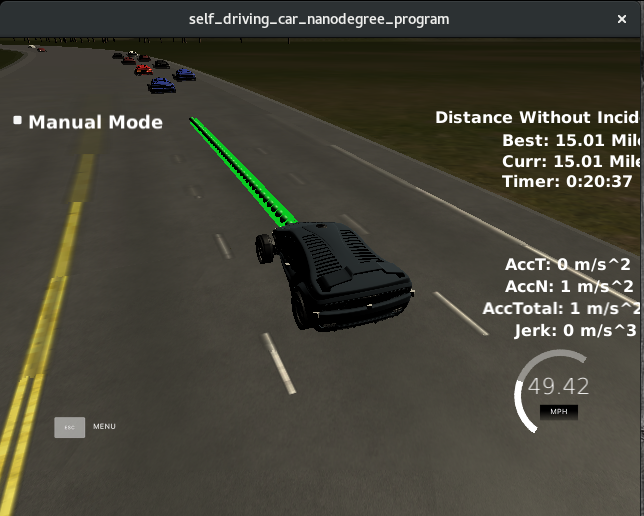

[image1]: ./images/path-planning.png "Autonomous Driving on a Highway"

# Path Planning
The goal of this project is to safely navigate around a virtual highway with other traffic that is driving +-10 MPH of the 50 MPH speed limit.

## Model

The overall model can be seperated into 3 main parts:

- Prediction,
- Behavior Planning
- Trajectory Generation 

### Prediction

### Behavior Planning

Based on the predictions of the current situation, the car increases or decreases the speed, or decide to change a lane when there are no surrounding cars and the lane exists. The behavior planning is simple structured as shown in the flow diagram below: 

Instead of increase/decrease the speed, the difference to the reference speed is noticed and its used for speed changes while generating the trajectory. This approach makes the car more responsive to changing situations like when a car in front of it trying to apply breaks to cause a collision.

### Trajectory Generation

The trajectory generation is based on the speed and lane output from the behavior, car coordinates and previous path points.

First, the last two points of the previous trajectory (or the car position if there are no previous trajectory) are used in conjunction three points at a far distance to initialize the spline calculation. To make the work less complicated to the spline calculation based on those points, the coordinates are transformed (shift and rotation) to local car coordinates.

In order to ensure more continuity on the trajectory (in addition to adding the last two point of the pass trajectory to the spline adjustment), the pass trajectory points are copied to the new trajectory. The rest of the points are calculated by evaluating the spline and transforming the output coordinates to not local coordinates. The speed change is decided on the behavior part of the code, but it is used in that part to increase/decrease speed on every trajectory points instead of doing it for the complete trajectory.

